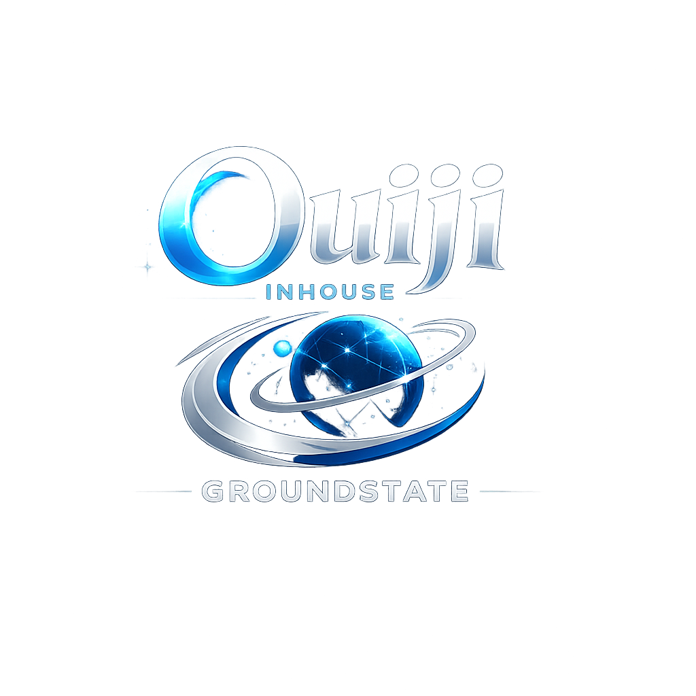

# Ouiji Chat



**Ouiji Chat** is Groundstate Technology LLC's modern instant-messenger platform: a deliberate return to the fast, personal, buddy-list experience of AOL Instant Messenger, rebuilt for today's networks.

The goal is simple: **bring back instant messaging as an actual application instead of turning every conversation into a social-media feed.**

Ouiji is designed to support two deployment models from the same product family:

1. **Groundstate-hosted public service** — the long-term internet service, with user accounts, presence, direct messages, rooms, profiles and shared infrastructure operated by Groundstate.
2. **Independent/private server deployment** — businesses, organizations, labs, teams, communities and closed networks can run their own Ouiji server and point their clients at that server instead of Groundstate infrastructure.

A private deployment can remain LAN-only or be operated on an organization's own secured network. That makes Ouiji useful both as a public AIM-style messenger and as a compact private communications system.

## Product identity and ownership

**Ouiji Chat is an official Groundstate Technology LLC product.** Groundstate controls the official name, trademarks, logos, release channels, hosted service, signing keys, official builds and product roadmap.

The source repository is open for community development under its stated software license, but open development does not transfer ownership of the official Ouiji product or Groundstate branding. Forks and modified distributions must comply with the code license and must use distinct branding unless Groundstate gives written permission.

Groundstate welcomes outside developers, testers, designers and security researchers. New contributions accepted into the official product are governed by `CONTRIBUTOR_AGREEMENT.md` so Groundstate can maintain coherent ownership of the official codebase and continue to offer public, private-server and future commercial deployment options.

See `PRODUCT_OWNERSHIP.md`, `CONTRIBUTOR_AGREEMENT.md`, `LICENSE` and `CONTRIBUTING.md`.

## What works now

- Compact Electron buddy list with people search
- Department-based directory and project rooms
- Separate direct-message and room windows
- Online/offline/busy/away/meeting presence
- Employee cards
- Automatic WebSocket reconnects
- Visible message timestamps
- Replaceable sent/received/sign-on/sign-off sounds
- Persistent local alpha message history
- Server-issued authenticated sessions for every window
- Scrypt password hashing
- Server-side authorization for directory, profile, history, direct-message and room operations
- WebSocket payload limits, request/login rate limits and heartbeat cleanup
- Electron sandboxing, context isolation, validated IPC and restrictive CSPs
- Localhost-only server binding by default
- Configurable server endpoint for LAN/private deployments
- Project doctor, syntax checks, regression tests and CI verification

## Deployment model

### Personal/local development

```powershell
npm install
npm run verify
npm run server
```

In another terminal:

```powershell
npm start
```

The safe default endpoint is `ws://localhost:8080/ws`.

### Business or closed-network server

Ouiji intentionally allows the client to connect to an independently operated server. A business or organization can deploy the server on its own machine, VM or internal network and configure clients to use that endpoint.

For LAN use, bind the server deliberately and configure `config.local.json` on clients. For routed or internet-connected deployments, use TLS termination and `wss://`, proper account administration, backups, monitoring and hardened host security.

The long-term architecture will keep the **client/server protocol portable** so an organization is not forced to use Groundstate's public service merely to use Ouiji.

## Requirements

- Node.js 22.12 or newer
- npm
- Windows, macOS or Linux capable of running Electron

## Demo accounts

Fresh alpha data seeds demonstration accounts. The initial demo password is `password` and is immediately stored as a salted scrypt hash rather than plaintext. **Do not use the seeded credential in a real deployment.**

## Useful commands

```text
npm start        Launch the Electron client
npm run server   Launch the WebSocket server
npm run doctor   Check project structure and security invariants
npm run check    Parse-check JavaScript sources
npm test         Run regression tests
npm run verify   Run doctor + syntax checks + tests
```

## Repository layout

```text
client/       Electron shell, buddy list, conversations and employee cards
server/       WebSocket server and security helpers
scripts/      Project diagnostics
tests/        Regression/security tests
sounds/       Replaceable application sounds
assets/       Groundstate/Ouiji branding
docs/         Architecture and deployment notes
config.json   Safe checked-in localhost configuration
```

Runtime account/message data is created under `server/data/` and is intentionally ignored by Git.

## Security model

Ouiji remains **pre-production software**. The current alpha is suitable for development and controlled testing, not for assuming production-grade confidentiality on an internet-facing service. See `SECURITY.md` before deployment.

## Roadmap

Near-term priorities include:

- public Groundstate-hosted account service
- hardened standalone/private-server package
- server administration console
- account/password management
- unread state and notifications
- delivery/read state
- room permissions
- safe file/image sharing
- message search
- durable database storage
- TLS/WSS deployment
- signed installers
- optional Groundstate Control Center identity integration for organizations
- server federation research without requiring federation for private installs

## Contributing

Community pull requests are welcome. Start with `CONTRIBUTING.md` and `CONTRIBUTOR_AGREEMENT.md`, run `npm run verify`, and keep changes scoped. Security-sensitive changes should include regression coverage.

## Support

See `SUPPORT.md` for Groundstate support links. Financial support does not purchase ownership, equity, IP rights or special licensing rights.

## Design principle

**Buddy List → Presence → Messages → Rooms → Files**

Fast enough to feel casual. Small enough to understand. Private-server capable by design.
